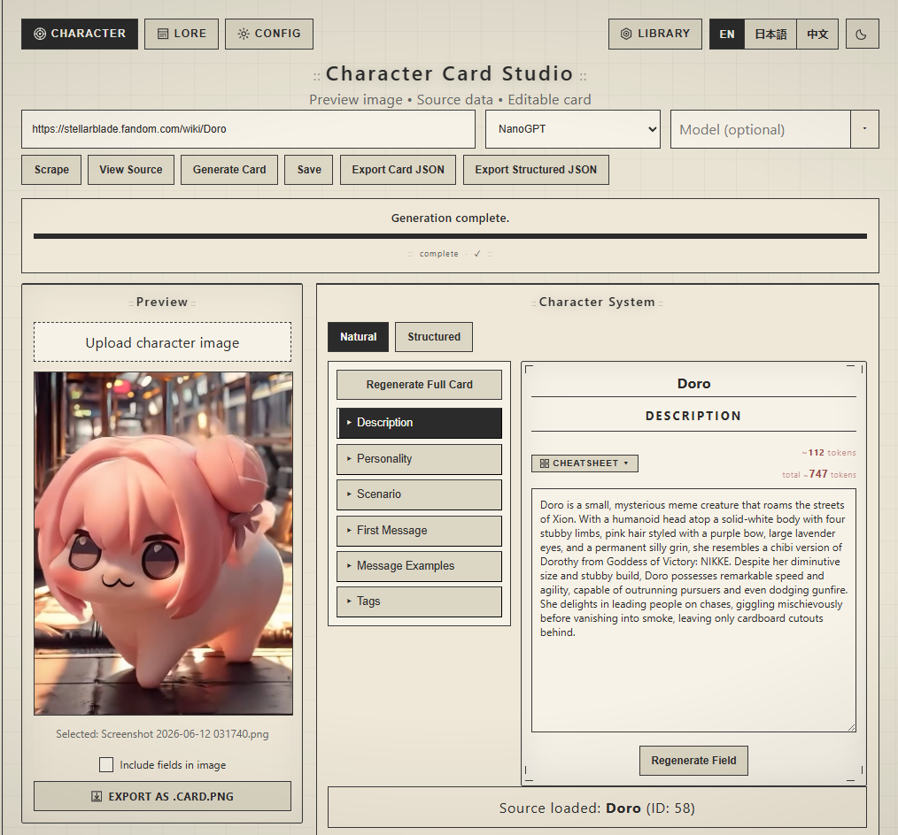

# Character Card Studio

A NieR:Automata–themed desktop app for generating SillyTavern character cards and lorebooks from Fandom wiki pages using AI.



---

## What's New in v2.1

### Local LLM Support
- **Local / OpenAI-compatible provider** — connect to any local LLM server alongside NanoGPT and OpenRouter
- Works with **LM Studio**, **Ollama**, **KoboldCPP**, or any server speaking the OpenAI `/v1/chat/completions` format
- Configure via `.env` or directly in **Config → API Keys**:
  - `LOCAL_OPENAI_BASE_URL` — your server's base URL (default: `http://localhost:1234/v1`)
  - `LOCAL_MODEL` — model name to request
  - `LOCAL_API_KEY` — API key if required (default: `local`)
- Unknown providers now fall back to local instead of crashing

---

## What's New in v2.0

### Character Studio
- **Library** — save, load, rename, duplicate, and delete cards with model info and timestamps
- **Alternate greetings** — multiple opening messages per character, each with its own AI regeneration button and custom prompt
- **Inline card renaming** — edit the card name directly in the field editor
- **Save confirmation toast** — visual feedback when saving
- **Token counter** — per-field tokens + total card token count in red
- **Field translations** — structured field labels translate with the language toggle
- **Natural/Structured toggle** — fixed active state styling in dark mode

### Lore Studio (New)
- **Single Page mode** — scrape one wiki page and extract multiple lorebook entries (characters, abilities, factions, locations, events, items, concepts)
- **Multiple Pages mode** — paste several URLs and process them all in one run
- **Projects** — organize entries into named lorebooks; clear or delete projects independently
- **Manual entry** — add blank entries or generate from a custom text prompt
- **Entry editor** — edit title, type, trigger keywords, and content
- **Export** — exports a SillyTavern V2 `lorebook.json`
- **Entry type filter chips** — ALL · CHARACTER · PLACE · FACTION · EVENT · ITEM · ABILITY · CONCEPT · OTHER

### Config Page (New)
- **Custom prompt templates** — override system prompts for character generation, field regeneration, and lore generation with variable chips and reset-to-default
- **Use custom templates toggle** — enable/disable custom prompts without deleting them
- **API keys** — manage NanoGPT and OpenRouter keys and default models in-app, saved to `.env` and reloaded without restart

### UI & Design
- NieR:Automata design system — `::` colon motifs, corner bracket ornaments, musical score dividers, CRT screen inset shadow
- **Dark / light theme** toggle with localStorage persistence
- **EN / 日本語 / 中文** language toggle — all UI labels, field names, buttons, and type chips translate
- NieR:Automata quotes cycle during model processing
- Responsive two-column layout with mobile breakpoints
- Improved loading bar — blank track with sweeping dark block animation

### Backend
- **JSON repair** — malformed model responses are salvaged instead of failing
- `max_tokens: 4096` on all requests to prevent output truncation
- Colored terminal logging — `[·]` info, `[✓]` success, `[!]` warning, `[✗]` error
- Job polling suppressed from Flask access log
- Database migrations run automatically on startup

---

## Features

### Character Studio
- Scrape any Fandom wiki page and generate a full SillyTavern V2 character card
- Natural & Structured views — edit description, personality, scenario, first message, and 20+ structured profile fields
- Field regeneration with custom prompt support
- Alternate greetings with per-entry AI regeneration
- PNG export with embedded SillyTavern metadata (`chara` tEXt chunk)
- Library with save, load, rename, duplicate, and delete

### Lore Studio
- Single page or multi-URL lorebook generation
- Named projects to organize separate lorebooks
- Manual entry creation and AI generation from custom text
- SillyTavern V2 lorebook export

### Config
- Custom system prompt templates per generation type
- API key management in-app for all three providers

---

## Stack

| Layer | Tech |
|---|---|
| Backend | Python 3 · Flask · SQLite |
| Frontend | React 18 · Vite · CSS |
| AI | NanoGPT · OpenRouter · Local OpenAI-compatible |
| Scraping | BeautifulSoup4 · requests |

---

## Setup

### Requirements
- Python 3.10+
- Node.js 18+

### Windows
```bat
setup_windows.bat
start_windows.bat
```

### Mac / Linux
```bash
chmod +x start_mac_linux.sh
./start_mac_linux.sh
```

Runs at `http://localhost:5173` with Flask backend on port 5000.

---

## Configuration

Copy `_env.example` to `.env` and add your keys:

```env
# NanoGPT
NANOGPT_API_KEY=your_key_here
NANOGPT_MODEL=zai-org/glm-4.7:thinking

# OpenRouter
OPENROUTER_API_KEY=your_key_here
OPENROUTER_MODEL=openai/gpt-4o-mini

# Local / OpenAI-compatible (LM Studio, Ollama, KoboldCPP, etc.)
LOCAL_OPENAI_BASE_URL=http://localhost:1234/v1
LOCAL_MODEL=local-model
LOCAL_API_KEY=local
```

Or manage everything in **Config → API Keys** in the app.

---

## Supported Providers

| Provider | Notes |
|---|---|
| [NanoGPT](https://nano-gpt.com) | Default — GLM, Qwen, and many others |
| [OpenRouter](https://openrouter.ai) | Claude, GPT-4o, Llama, Mistral, and more |
| Local | Any OpenAI-compatible server — LM Studio, Ollama, KoboldCPP |

---

## SillyTavern Compatibility

Exported cards follow the **Character Card V2** spec. Exported lorebooks follow the **Lorebook V2** spec. Both import directly into SillyTavern.

---

## License

MIT
