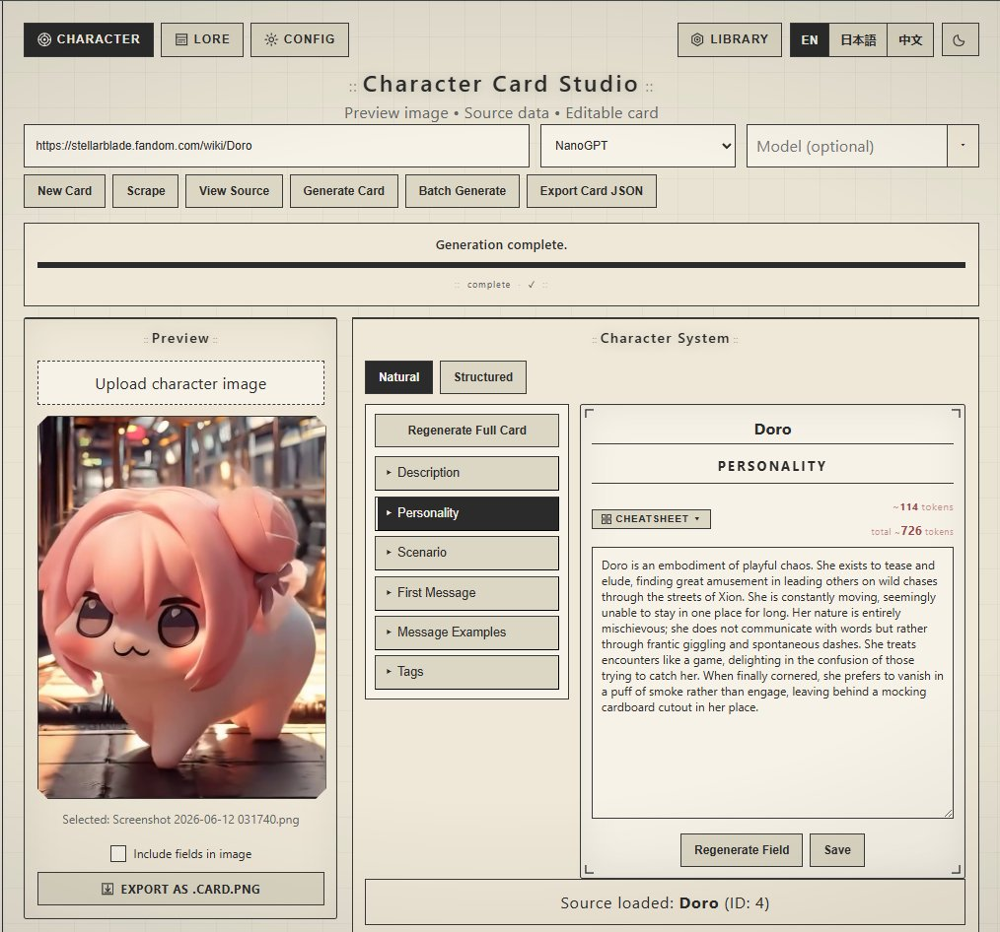

# Character Card Studio

A Signal UI–themed app for generating SillyTavern character cards and lorebooks from Fandom wiki pages using AI.



---

## Quick Start

### Step 1 — Install requirements (first time only)

**Windows:**
```bat
setup.bat
```

**Mac / Linux:**
```bash
chmod +x setup.sh
./setup.sh
```

The setup script will:
- Check that Python 3.10+ and Node.js 18+ are installed (and tell you where to get them if not)
- Create a Python virtual environment
- Install all Python and frontend dependencies
- Create your `.env` file from the example

> If Python or Node.js are missing, the script will give you the download link and stop — install them and run setup again.

### Step 2 — Add your API keys

Open `.env` in any text editor and add at least one API key:
```env
NANOGPT_API_KEY=your_key_here
```

### Step 3 — Launch

**Windows:**
```bat
start.bat
```

**Mac / Linux:**
```bash
./start.sh
```

Your browser will open automatically at `http://localhost:5173`.
After the first run, launching is instant.

---

## Features

### Character Studio
- Scrape any Fandom wiki page and generate a full SillyTavern V2 character card
- **New Card** — create a blank card manually without scraping, fill everything in yourself
- **Batch Generate** — paste up to 10 URLs and generate all cards in one job
- Natural & Structured views — edit description, personality, scenario, first message, and 22 structured profile fields
- Structured profile includes: age, sex, gender, ethnicity, race, pronouns, sexual attraction, appearance, clothing, accessories, backstory, speech patterns, personality traits, likes, dislikes, loves, hates, kinks, relationship status, height, weight
- Field regeneration with custom prompt support and live timer
- Alternate greetings with per-entry AI regeneration
- PNG export with embedded SillyTavern metadata (`chara` tEXt chunk)
- Cheatsheet bar — click to insert SillyTavern variables into any field
- Library with save, load, search, rename, duplicate, and delete

### Lore Studio
- Single page or batch multi-URL lorebook generation (up to 20 URLs)
- Valid/reason validation — bad pages are skipped with a logged reason instead of generating garbage entries
- Named projects to organise separate lorebooks
- SillyTavern V2 lorebook fields per entry: Scan Depth, Insertion Order, Entry Depth
- Move entries between projects
- Manual entry creation and AI generation from custom text
- SillyTavern V2 lorebook JSON export

### Config
- Temperature slider (0.0–1.0) — controls creativity vs precision
- Max Tokens dropdown (1024 / 2048 / 4096 / 8192)
- Custom system prompt templates per generation type
- API key management in-app for all three providers
- Model picker with live fetch from NanoGPT or OpenRouter (shows context window and price per token)

### Scraper
- Supports 50+ section heading aliases across action games, JRPGs, fighting games, and general wikis
- URL fragment stripping (`Chun-Li#SF6` → `Chun-Li`)
- Fandom tab panel extraction (Personality, Appearance tabs on RE wiki etc.)
- JSON-LD image fallback for wikis without standard infobox images
- Date-pattern section routing (`Raccoon City (1998)` → history)
- Birth year → age calculation (`c. 1974` → `~52 (b. c. 1974)`)
- Wiki hedging cleanup (`"Unknown or Chinese"` → `"Chinese"`)

### UI
- Signal UI design system — light and dark mode
- EN / 日本語 / 中文 interface
- Live elapsed timer on all jobs and field regeneration
- Animated progress bar, typing effect, glitch label, save flash

---

## Configuration

Copy `_env.example` to `.env` and add your API keys:

```env
# NanoGPT
NANOGPT_API_KEY=your_key_here
NANOGPT_MODEL=zai-org/glm-4.7:thinking

# OpenRouter
OPENROUTER_API_KEY=your_key_here
OPENROUTER_MODEL=openai/gpt-4o-mini

# Local / OpenAI-compatible (LM Studio, Ollama, KoboldCPP, etc.)
LOCAL_OPENAI_BASE_URL=http://localhost:1234/v1
LOCAL_MODEL=local-model
LOCAL_API_KEY=local
```

Or manage everything in **Config → API Keys** inside the app.

---

## Stack

| Layer | Tech |
|---|---|
| Backend | Python 3 · Flask · SQLite |
| Frontend | React 18 · Vite |
| AI | NanoGPT · OpenRouter · Local OpenAI-compatible |
| Scraping | BeautifulSoup4 · requests |

---

## Requirements

- Python 3.10+
- Node.js 18+

---

## Supported Providers

| Provider | Notes |
|---|---|
| [NanoGPT](https://nano-gpt.com) | Default — GLM, Qwen, and many others |
| [OpenRouter](https://openrouter.ai) | Claude, GPT-4o, Llama, Mistral, and more |
| Local | Any OpenAI-compatible server — LM Studio, Ollama, KoboldCPP |

---

## Uninstalling

Delete the project folder. Nothing is written to your system, registry, or AppData outside the folder itself. Python and Node.js can be uninstalled separately from your system's app manager if no longer needed.

---

## License

MIT
